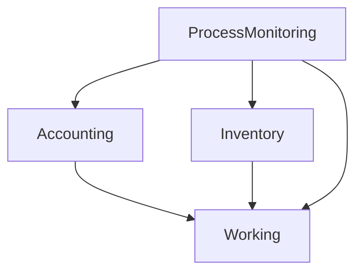

# System Architecture

## Current Architecture
The ProcessMonitoring project is a monolithic web application built on **Django 6.0.6**. 
It utilizes the Model-Template-View (MTV) pattern.

### Components
1. **Database**: MySQL.
2. **Backend**: Python/Django.
3. **Frontend**: Server-Side Rendered (SSR) HTML via Django Templates, styled with custom CSS and vanilla JavaScript.
4. **Apps**:
   - `ProcessMonitoring`: Core settings and routing.
   - `Working`: Core module for user management, product configuration, and production stages (Cut, KCS, Finishing).
   - `Accounting`: Financial module (Prices, Exports, Payments).
   - `Inventory`: Warehouse module (Receipts, Issues).

## Target Architecture (React Migration)
**Status**: 
- **IMPLEMENTED**: DRF Foundation installed. `/api/v1/` namespace created.
- **NOT IMPLEMENTED YET**: JWT Auth, API endpoints, React frontend.

In the future, the architecture will migrate to a decoupled SPA (Single Page Application).
During the migration, BOTH architectures coexist:
```text
Browser
   ├── Django Templates (Legacy UI)
   └── REST API (New React UI)
```
1. **Database**: MySQL (Unchanged).
2. **Backend API**: Django + Django REST Framework 3.18.0 providing JSON endpoints under `/api/v1/`.
3. **Authentication**: **IMPLEMENTED (Phase 3B-2)** - Custom JWT Authentication mapping exactly to the `AppUser` model without breaking legacy sessions.
4. **Frontend**: React application communicating with the backend via REST API (Phase 3C - NOT STARTED).

### Django Application Dependencies
The Django backend relies heavily on the `Working` app, forming this exact dependency tree:

